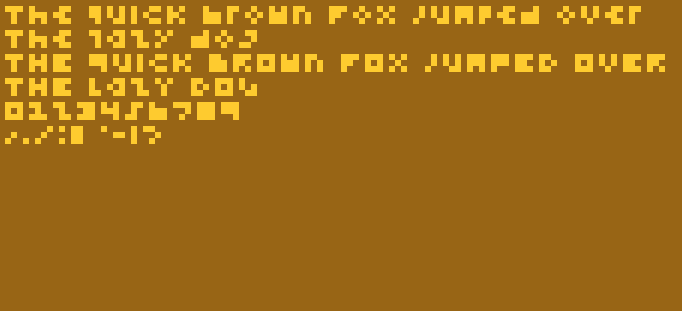
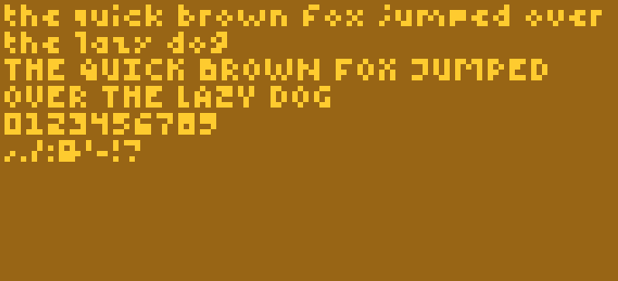
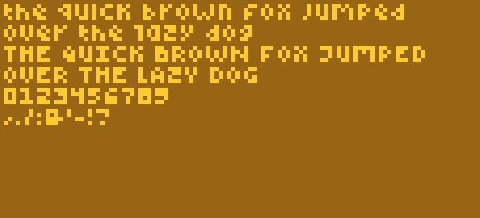
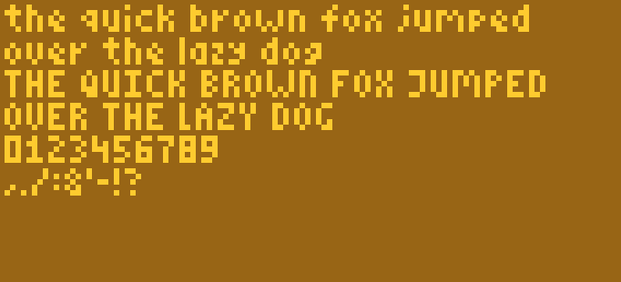
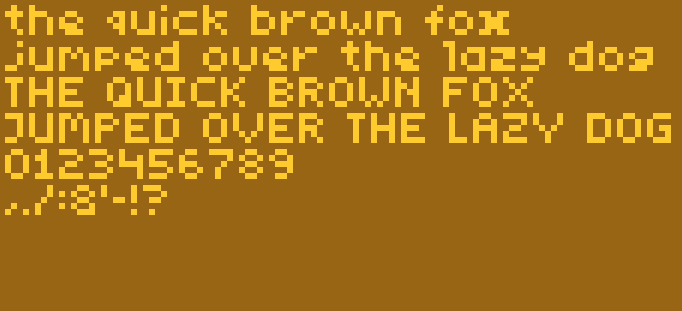
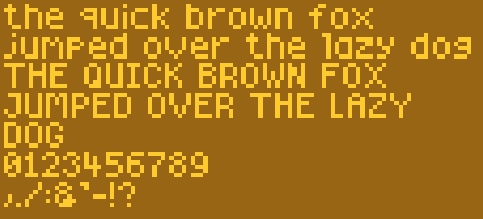

# CHIPCODE fonts

This is the long-missing CHIP-8 text rendering library you've been wishing
existed already so you didn't have to write it! 😄


Featuring:
  * Six different fonts in different text sizes, ranging from insanely small to
    really quite big
  * An easy system to adapt fonts or add new fonts of your own
  * Text positioning
  * Text boxing (to stay within a given width or not overflow a given height)
  * Proper word wrapping, if desired
  * Multiple fonts in one project, if desired

## Binary sizes

Since this is CHIP-8, the first question to ask is: how many bytes will this
cost me? There are two parts to this that take up space: the library, of which
there are a couple of flavours:

| Library | Binary size |
|---------|----------------|
<library-sizes-table>

(See below for which one to choose)

And an actual font, of which we also have a couple to choose from. The number of
pixels in the font name refer to the height of the displayed characters. The
rest of the name refers to the characteristics of the font:

| Font | Binary size |
|------|----------------|
<font-sizes-table>

Since you can load multiple fonts if you wish, you can make it as wild as you
see fit. But as you can see the total binary size mostly depends on the
character height of the chosen font and on if your project needs word wrapping
or not.

## Speed

The second question is usually: how many CPU cycles will this cost me?

Drawing text is not a fast thing to do. Looking up each character in a string,
finding the right font data for that character and drawing it to the screen
takes quite a bit of time. If you're running in the tens of cycles per frame you
will definitely see the text build up character by character.

Word wrapping is also quite slow. And what's worse is that while the library is
calculating where the text should wrap there will be absolutely no feedback.
Which may result in looking at a blank screen for a couple of seconds (at low
cycles per frame).

So either don't use word wrapping and accept that text will take some time to
build up (which can be a fun effect of its own) or run this library at at least
a couple hundred cycles per frame. You have been warned 😉

## Available fonts

All fonts included with this library have been hand-drawn by me. Any resemblance
to existing typefaces is either pure coincidence or a result of the limited
space of possibilities at these low resolutions. I have released these fonts
under a [Creative Commons Attribution-NonCommercial 4.0 International
License](http://creativecommons.org/licenses/by-nc/4.0/).

[](http://creativecommons.org/licenses/by-nc/4.0/)

This basically means that you may use them for anything you like, as long as
your work does not have a commercial purpose, and as long as you give credit (a
link back to the [project Github](.) or [NPM
page](https://www.npmjs.com/package/@chipcode/fonts) will suffice).

### `3-pix`



### `4-pix-low`



### `4-pix-high`



### `5-pix-narrow`



### `5-pix-wide`



### `6-pix`



## Example code

This program (which uses [Octopus](../octopus) syntax for brevity) generates the
screenshot at the top of this README file:

```python
# Include the font-header first, it contains the constants and macros needed to
# define and draw your strings
:include "font-header.8o"

: main
  hires
  clear

  setFont font-5-pix-wide
  drawTextWrapped quote 14 10 114 64

  setFont font-4-pix-low
  drawText signature 40 47 118 64

  loop again

: quote
  str "I really should have included text rendering with custom fonts in the CHIP-8 instruction set from the start!" str-end
: signature
  str "-- Joseph Weisbecker" str-end

# Include the font library anywhere you like
:include "font-library.8o"

# Include the font data for the font(s) you want to use at the end if you use
# XO-CHIP (in the non-executable space). Or anywhere you like otherwise.
:include "fonts/5-pix-wide.8o"
:include "fonts/4-pix-low.8o"
```

## Installing

To install these fonts, you need to add three parts to your source file:

  1. A header file containing the constants and macros needed to define and draw
     your strings. Add this above where you want to use text drawing;
  2. The actual font library, which can be added pretty much anywhere as long as
     it can be called / jumped to;
  3. One or more fonts.

See the code example above.

You can manually copy and paste the contents of the pre-built files in
[`dist`](./dist) into your own Octo source files, or follow the guide below for
a more elegant solution.

### Installing as a dependency

I'm still figuring out a nice way to make this nice and painless. For now, you
could install [Octopus](../octopus) and the fonts:

```bash
npm install --save-dev @chipcode/octopus @chipcode/fonts
```

And then include the necessary files in your project like so:

```python
:include "node_modules/@chipcode/fonts/dist/font-header.8o"
:include "node_modules/@chipcode/fonts/dist/font-library.8o"
:include "node_modules/@chipcode/fonts/dist/fonts/4-pix-low.8o"
```

If you look at the [`dist/fonts`](./dist/fonts) directory, you will see which
files you can include for the fonts.

Then you can build your project by invoking:

```bash
npx octopus your-project.8o your-project-built.8o
```

## Programming API

### `setFont <pointer-to-font>`

Select the given font to be used for all following `drawText` and
`drawTextWrapped` invocations. The pointer should be one of the following,
corresponding to which font file you have loaded:

  * `font-3-pix`
  * `font-4-pix-low`
  * `font-4-pix-high`
  * `font-5-pix-narrow`
  * `font-5-pix-wide`
  * `font-6-pix`

Or it can be a pointer to [your own font definition](#modifying-fonts-or-making-your-own).

Make sure you use `setFont` before you try to draw any text!

### `drawText <pointer-to-string> minX minY maxX maxY`

Draw a string of text to the box defined by `minX`, `minY`, `maxX` and `maxY`.
`minX` and `minY` define the top left corner of the text drawn. `maxX` defines
the boundary at which the text wraps. `maxY` defines the boundary at which the
text overflows (stops being drawn).

If you're not interested in wrapping or overflowing, just set `maxX` to `64` or
`128` and `maxY` to `32` or `64` (depending on if you're using `lores` or
`hires`).

```python
  # Draw my string in the top left corner
  drawText my-string 0 0 64 32
```

Strings are defined like this:

```python
: my-string
  str "Hello CHIP-8!" str-end
```

The `str` macro tells Octo how to encode the string that follows. `str-end` tells the font library where the string ends. You can also use `str-newline` to insert new lines:

```python
: my-broken-string
  str "Hello" str-newline
  str "World!" str-end
```

Please be aware that you can only use characters that are actually present in
the [fonts](#available-fonts) shown above.

### `drawTextWrapped <pointer-to-string> minX minY maxX maxY`

`drawTextWrapped` is the word-wrapping version of `drawText`. It works exactly
the same, except that `drawText` can wrap on any character when it hits `maxX`
whereas `drawTextWrapped` will only wrap on word boundaries. Unless the space
between `minX` and `maxX` is too small for the word to fit in.

```python
  # Draw a long string from the top left corner
  drawTextWrapped long-string 0 0 64 32
```

## Modifying fonts or making your own

It's fairly easy to modify the supplied fonts or to use the font library with
your own font. You can load any valid font definition with `setFont`:

```octo
  setFont my-font
```

Font definitions follow this basic structure:

```python
: my-font
  4 # Global character height of this font in pixels

  5 # Character width of this specific character in pixels, including any margins
  0b01100000  # Bitmap data for character "A"
  0b10010000
  0b11110000
  0b10010000

  4 # Character width of this specific character in pixels, including any margins
  0b10000000  # Bitmap data for character "B"
  0b10000000
  0b11100000
  0b11100000
```

Having to hand-code each character gets pretty tedious pretty quickly though.
The easiest way to build up this data structure is by editing an actual image.
This is the image format I use for my fonts:


The scattered dots in the first and seventh line are the character widths in
binary. The last empty character represents the space. See the
[`fonts`](./fonts) directory for the images for all included fonts, which can
also be a great starting-point for your own adaptations.

You can import the font image using the [image-loader](../image-loader) plugin
to Octopus. Like so:

```python
: my-font
  4 # Global character height of this font in pixels
  :include "my-font.png" 8x5 no-labels
```
