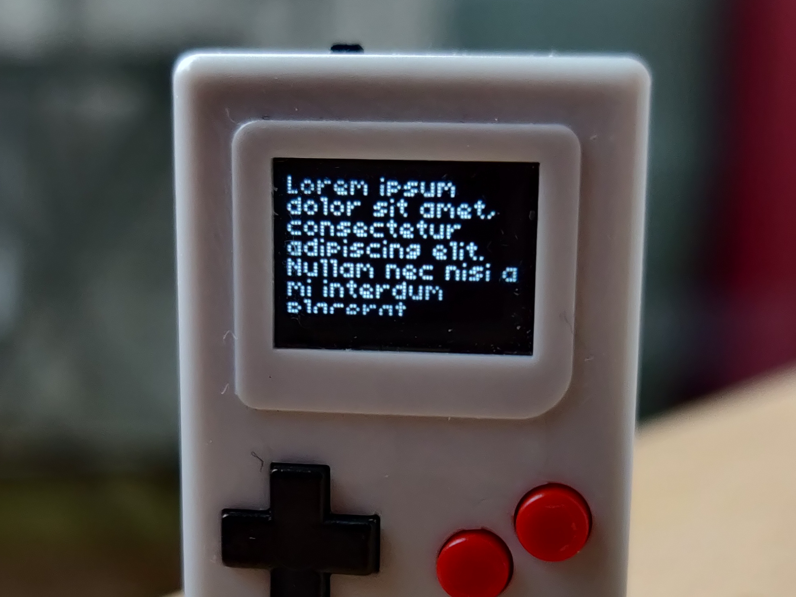
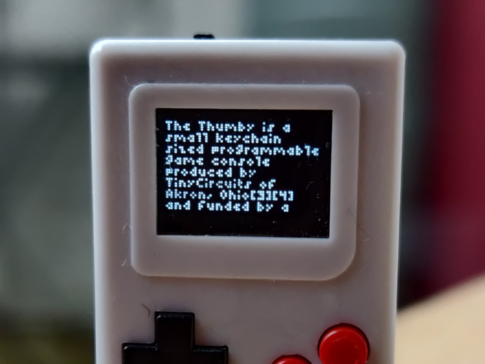
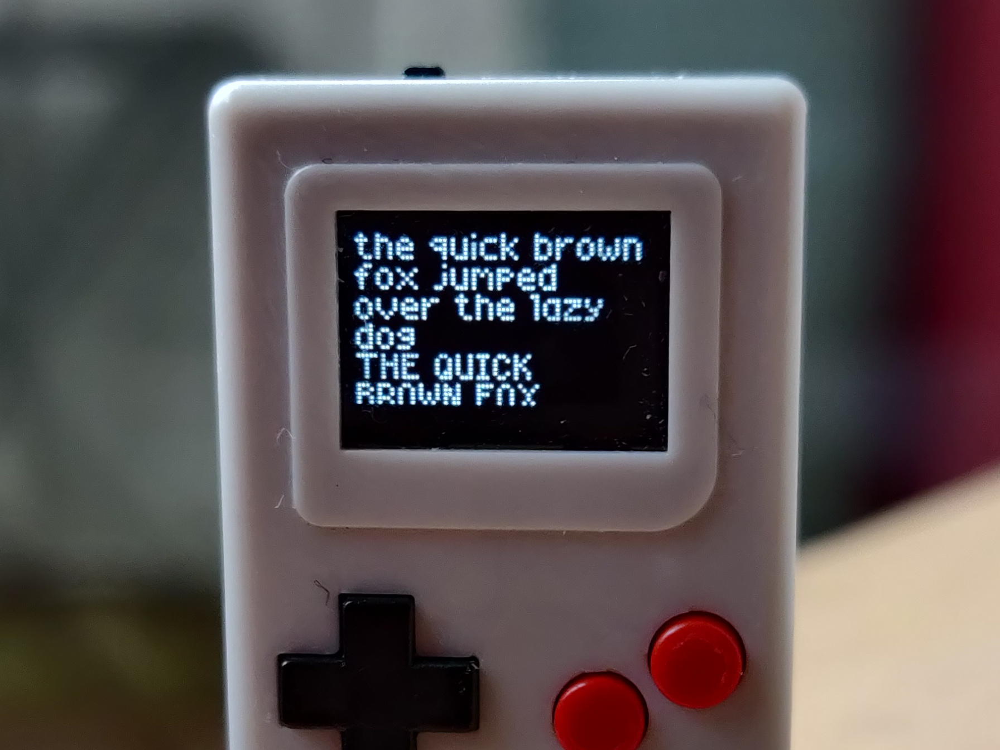
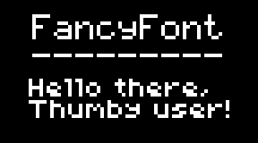
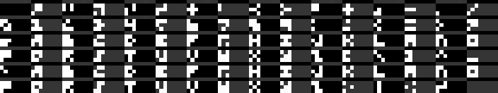
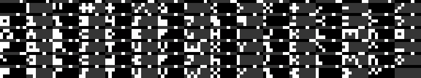
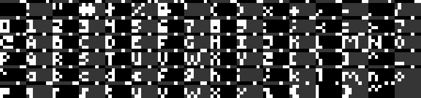
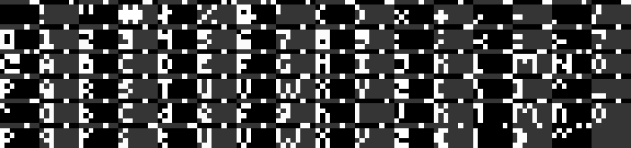
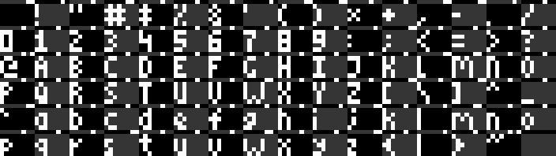
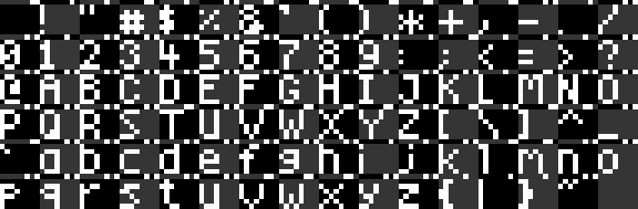

# FancyFont

_A MicroPython font library for the Thumby playable keychain console_

FancyFont is a drop-in replacement to the `setFont()` and `drawText()` functions in
the Thumby API. It has a couple of improvements over those functions:

  * Support for word wrapping with `drawTextWrapped()`
  * Support for clipping (and not just at the edge of the screen)
  * Support for the newline character (`\n`) in strings
  * Support for variable width fonts
  * Can render to any bytearray buffer, so "should work" with grayscale or
    non-Thumby projects too

(This sub-project is in this repository because I didn't think it really needed
its own repository. And also so it can share font definitions with the CHIP-8
version of the library.)

## Table of contents

  * [Cool pictures](#cool-pictures)
  * [Getting the library](#getting-the-library)
    * [Minified version](#minified-version)
  * [Explanation by example](#explanation-by-example)
    * [`setFont`](#setfont)
    * [`drawText`](#drawtext)
    * [`drawTextWrapped`](#drawtextwrapped)
    * [Constructor](#constructor)
  * [Available fonts](#available-fonts)
    * [Auri](#auri)
    * [threesquare](#threesquare)
    * [Ausgezeichnet](#ausgezeichnet)
    * [Black sheep](#black-sheep)
    * [Limited Narrow](#limited-narrow)
    * [Widewest](#widewest)
    * [Truthful](#truthful)
    * [TinyCircuits fonts](#tinycircuits-fonts)
  * [API documentation](#api-documentation)
    * [`Class FancyFont`](#class-fancyfont)
      * [`__init__`](#__init__displaybuffer-displaywidth--72-displayheight--40)
      * [`setFont`](#setfontfontpath-widthint--none-heightint--none-spaceint--1)
      * [`drawText`](#drawtextstring-xposint-yposint-colorint--1-xmaxint--none-ymaxint--none)
      * [`drawTextWrapped`](#drawtextwrappedstring-xposint-yposint-colorint--1-xmaxint--none-ymaxint--none)

## Cool pictures

Here's what some of the fonts look like on an actual Thumby! Sorry for the
almost microscopic little dust and hairs on the device 😂


_Example of the Widewest font_


_Example of the Ausgezeichnet font_


_Example of the Truthful font_

## Getting the library

You can [download the FancyFony library
here](https://github.com/Timendus/chipcode/raw/main/fonts/thumby/fancyFont.py).
You'll also need one or more font files. You can find an overview with downloads
in the [Available fonts](#available-fonts) section of this manual.

After that, you will have to upload both the fonts and the library to your
Thumby in a place where your program will be able to find them. More about that
below in the chapter [Explanation by example](#explanation-by-example).

### Minified version

Note that there is also a file called
[`fancyFont-minified.py`](https://github.com/Timendus/chipcode/raw/main/fonts/thumby/fancyFont-minified.py)
in this repository, which is functionally the same library, but without all the
comments and documentation:

```
   15K  fancyFont.py
  4.1K  fancyFont-minified.py
```

It makes quite a bit of difference, so you may want to ship your project with
the minified version of the library.

## Explanation by example

To render this to the display using FancyFont:



And assuming that you have uploaded the FancyFont library and the Widewest font
to `/Games/MyGame/`, you need to do something like this:

**`/Games/MyGame/MyGame.py`**
```python
# Fix import path so we can import files in our game directory
from sys import path
path.insert(0, '/Games/MyGame')

# Load either `thumby` or `thumbyGraphics` library
import thumbyGraphics

# Load and initialize `FancyFont` library
from fancyFont import FancyFont
fancyFont = FancyFont(thumbyGraphics.display.display.buffer)

# Clear the screen
thumbyGraphics.display.fill(0)

# Select a TinyCircuits font and draw some text
fancyFont.setFont('font5x7.bin', 5, 7)
fancyFont.drawText('FancyFont\n---------', 9, 4)

# Select a FancyFont font and draw some wrapping text
fancyFont.setFont('5pix-widewest.bin')
fancyFont.drawTextWrapped('Hello there, Thumby user!', 8, 22)

# Show the result
thumbyGraphics.display.update()
```

There are a few interesting differences with the regular Thumby API to note in
the example above:

### `setFont`

`setFont` will actually search the system path if the given string is not an
absolute path. This means you can just call `setFont('font5x7.bin', 5, 7)` and
it will find this file in the `/lib` folder, which is in the default path. After
adding our project's directory to the path (in lines 2 and 3 of the example) we
can also load a font that is stored in our project directory, with
`setFont('5pix-widewest.bin')`.

Something else to notice is that `setFont` can take three more parameters
(character width, character height and gap width) for compatibility with the
Thumby API. But the gap width (or "space") will now default to `1`, which is
usually what it's set to anyway.

When loading variable width fonts in the FancyFont format, you must not give
`setFont` a character width and height. That will tell it that you're loading a
variable width font, and load the dimensions from the file. This is what happens
in the line that says `setFont('5pix-widewest.bin')`.

### `drawText`

The `drawText` function seems to behave similarly to the Thumby API version at
first, but there are some differences. First, we can omit the color parameter if
we want to draw in white. Second, it will do the right thing if you give it a
string with a newline character (`\n`) as shown in the example on line 17.
Third, this version of `drawText` accepts two more parameters to tell it to clip
the string at some row and column.

### `drawTextWrapped`

`drawTextWrapped` accepts the same inputs as `drawText`, the difference being
that `drawTextwrapped` will treat the clipping column as the point to word-wrap
the string instead.

### Constructor

Finally, both `drawText` and `drawTextWrapped` draw to the buffer that you
specify in the FancyFont constructor. You must give the constructor a buffer
(generally a bytearray) and optionally a width and a height, which default to 72
and 40. For normal operation this means you just do:

```python
fancyFont = FancyFont(thumbyGraphics.display.display.buffer)
  # or
fancyFont = FancyFont(thumby.display.display.buffer)
```

But it gives you some flexibility to draw into another buffer, for example for
use with the grayscale library. It also probably means that this library is not
really a Thumby library, but rather a generic MicroPython library, and could
probably be used for projects on other MicroPython based platforms too.

## Available fonts

The fonts shipped with this library are released under the [Creative Commons
Attribution-ShareAlike
license](https://creativecommons.org/licenses/by-sa/4.0/).

This means that when you use these fonts in your own projects, you are required
to give credit to the author and that derivative works may only be distributed
under the same or a compatible license. This way we make sure the body of
publicly available pixel art fonts will only grow over time.

The 3x3 fixed width font called "Auri" was designed by Thumby Discord regular
Auri, with feedback from the Thumby community. You may give him credit as such.

The other fonts have been designed by myself
([Timendus](https://github.com/Timendus/)). Please credit me by linking to [this
font library](.), so others may find it and the fonts contained in it.

### Auri

|  |  | 
|-------|-------------|
| Type | Fixed width |
| Size | 3 by 3 pixels |
| Author | Auri |
| License | [Creative Commons Attribution-ShareAlike](https://creativecommons.org/licenses/by-sa/4.0/) |
| Download | [`3x3-auri.bin`](https://github.com/Timendus/chipcode/raw/main/fonts/thumby/fonts/fixed-width/3x3-auri.bin) |



### threesquare

|  |  | 
|-------|-------------|
| Type | Variable width |
| Height | 3 pixels |
| Author | Timendus |
| License | [Creative Commons Attribution-ShareAlike](https://creativecommons.org/licenses/by-sa/4.0/) |
| Download | [`3pix-threesquare.bin`](https://github.com/Timendus/chipcode/raw/main/fonts/thumby/fonts/variable-width/3pix-threesquare.bin) |



### Ausgezeichnet

|  |  | 
|-------|-------------|
| Type | Variable width |
| Height | 4 pixels |
| Author | Timendus |
| License | [Creative Commons Attribution-ShareAlike](https://creativecommons.org/licenses/by-sa/4.0/) |
| Download | [`4pix-ausgezeichnet.bin`](https://github.com/Timendus/chipcode/raw/main/fonts/thumby/fonts/variable-width/4pix-ausgezeichnet.bin) |



### Black sheep

|  |  | 
|-------|-------------|
| Type | Variable width |
| Height | 4 pixels |
| Author | Timendus |
| License | [Creative Commons Attribution-ShareAlike](https://creativecommons.org/licenses/by-sa/4.0/) |
| Download | [`4pix-black-sheep.bin`](https://github.com/Timendus/chipcode/raw/main/fonts/thumby/fonts/variable-width/4pix-black-sheep.bin) |



### Limited Narrow

|  |  | 
|-------|-------------|
| Type | Variable width |
| Height | 5 pixels |
| Author | Timendus |
| License | [Creative Commons Attribution-ShareAlike](https://creativecommons.org/licenses/by-sa/4.0/) |
| Download | [`5pix-limited-narrow.bin`](https://github.com/Timendus/chipcode/raw/main/fonts/thumby/fonts/variable-width/5pix-limited-narrow.bin) |



### Widewest

|  |  | 
|-------|-------------|
| Type | Variable width |
| Height | 5 pixels |
| Author | Timendus |
| License | [Creative Commons Attribution-ShareAlike](https://creativecommons.org/licenses/by-sa/4.0/) |
| Download | [`5pix-widewest.bin`](https://github.com/Timendus/chipcode/raw/main/fonts/thumby/fonts/variable-width/5pix-widewest.bin) |


### Truthful

|  |  | 
|-------|-------------|
| Type | Variable width |
| Height | 6 pixels |
| Author | Timendus |
| License | [Creative Commons Attribution-ShareAlike](https://creativecommons.org/licenses/by-sa/4.0/) |
| Download | [`6pix-truthful.bin`](https://github.com/Timendus/chipcode/raw/main/fonts/thumby/fonts/variable-width/6pix-truthful.bin) |



### TinyCircuits fonts

|  |  | 
|-------|-------------|
| Type | Fixed width |
| Size | 3 by 5 pixels |
| Author | TinyCircuits |
| License | [GNU General Public License v3](https://github.com/TinyCircuits/TinyCircuits-Thumby-Code-Editor/blob/master/LICENSE) |
| Download | [`font3x5.bin`](https://github.com/TinyCircuits/TinyCircuits-Thumby-Code-Editor/raw/master/ThumbyGames/lib/font3x5.bin) |

|  |  | 
|-------|-------------|
| Type | Fixed width |
| Size | 5 by 7 pixels |
| Author | TinyCircuits |
| License | [GNU General Public License v3](https://github.com/TinyCircuits/TinyCircuits-Thumby-Code-Editor/blob/master/LICENSE) |
| Download | [`font5x7.bin`](https://github.com/TinyCircuits/TinyCircuits-Thumby-Code-Editor/raw/master/ThumbyGames/lib/font5x7.bin) |

|  |  | 
|-------|-------------|
| Type | Fixed width |
| Size | 8 by 8 pixels |
| Author | TinyCircuits |
| License | [GNU General Public License v3](https://github.com/TinyCircuits/TinyCircuits-Thumby-Code-Editor/blob/master/LICENSE) |
| Download | [`font8x8.bin`](https://github.com/TinyCircuits/TinyCircuits-Thumby-Code-Editor/raw/master/ThumbyGames/lib/font8x8.bin) |

## API documentation

### Class FancyFont

A container class that holds functions for font rendering for fixed width and
variable width fonts, with optional word-wrapping.

Methods:

  * `__init__`
  * `setFont`
  * `drawText`
  * `drawTextWrapped`

Attributes:

  * None that should be manipulated by the user

#### `__init__(displayBuffer, displayWidth = 72, displayHeight = 40)`

Constructor function to initialize the FancyFont class.

Parameters:

  * `displayBuffer` : `object`
    * The display buffer to draw to. Usually
      thumbyGraphics.display.display.buffer.

  * `displayWidth` : `int`
    * The width of the display to draw to, in pixels. Usually
      thumbyGraphics.display.width. Defaults to 72.

  * `displayHeight` : `int`
    * The height of the display to draw to, in pixels. Usually
      thumbyGraphics.display.height. Defaults to 40.

#### `setFont(fontPath, width:int = None, height:int = None, space:int = 1)`

Set the font file at `fontPath` as the current font to be used for all
subsequent drawText commands.

Parameters:

  * `fontPath` : `string`
      * A path to a file that contains a font in either the TinyCircuits
        fixed width font file format or a FancyFont variable width font
        file. Path may be absolute or relative to any entry in `sys.path`.

  * `width` : `int`
      * The character width of the font, if the font is fixed width. Omit or
        supply `None` for variable width. Note that characters with a width
        of more than 8 pixels are *not supported*.

  * `height` : `int`
      * The character height of the font, if the font is fixed width. Omit
        or supply `None` for variable width font files. The character height
        will then be read from the font file. Note that characters with a
        height of more than 8 pixels are *not supported*.

  * `space` : `int`
      * The margin between characters for fixed width fonts. Defaults to 1.
        Ignored for variable width fonts.

#### `drawText(string, xPos:int, yPos:int, color:int = 1, xMax:int = None, yMax:int = None)`

Draw a string within the square defined by (xPos, yPos) and (xMax, yMax), in
the given color.

Parameters:

  * `string` : `string`
      * The string to draw to the screen.

  * `xPos` : `int`
      * The X coordinate to start drawing from, counting from the left side
        of the screen.

  * `yPos` : `int`
      * The Y coordinate to start drawing from, counting from the top of the
        screen.

  * `color` : `int`
      * The color to draw the string in: either 1 (white) or 0 (black).

  * `xMax` : `int`
      * The X coordinate to stop drawing from, counting from the left side
        of the screen. Any text wider than xMax - xPos will be clipped.
        Defaults to the display width supplied to the constructor.

  * `yMax` : `int`
      * The Y coordinate to stop drawing from, counting from the top of the
        screen. Any line of text higher than yMax - yPos will be clipped.
        Defaults to the display height supplied to the constructor.


#### `drawTextWrapped(string, xPos:int, yPos:int, color:int = 1, xMax:int = None, yMax:int = None)`

Draw a string within the square defined by (xPos, yPos) and (xMax, yMax), in
the given color with word wrapping.

Parameters:

  * `string` : `string`
      * The string to draw to the screen.

  * `xPos` : `int`
      * The X coordinate to start drawing from, counting from the left side
        of the screen.

  * `yPos` : `int`
      * The Y coordinate to start drawing from, counting from the top of the
        screen.

  * `color` : `int`
      * The color to draw the string in: either 1 (white) or 0 (black).

  * `xMax` : `int`
      * The X coordinate to wrap the text at, counting from the left side of
        the screen. Defaults to the display width supplied to the
        constructor.

  * `yMax` : `int`
      * The Y coordinate to stop drawing from, counting from the top of the
        screen. Any text higher than yMax - yPos will be clipped. Defaults
        to the display height supplied to the constructor.
