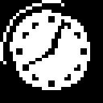
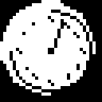
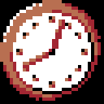

# Octopus 2

This command line tool is a pre-processor and assembler for Octo-flavoured
CHIP-8 assembly language. You (should) have obtained this software from
https://github.com/Timendus/chipcode/tree/main/octopus2.

Octopus 2 is a rewrite in Go of my original [JavaScript implementation of the
Octopus pre-processor](../octopus). I have compiled in [John Earnest's
c-octo](https://github.com/JohnEarnest/c-octo) so this new version can be used
as an assembler too.

As a pre-processor versions one and two are functionally nearly identical,
except that this implementation runs quite a bit faster and has image support
built-in. No need to install an additional plugin. It also has beta support for
color images with multiple planes for XO-CHIP and dithering, which the original
does not.

All in all this version is much more a one-stop shop for writing CHIP-8 ROMs
than the original Octopus.

# Installing and running

You can download a binary of Octopus 2 from Github. It gets built automatically
each time the repository gets updated. Go to the [Github actions
tab](https://github.com/Timendus/chipcode/actions?query=branch%3Amain+is%3Asuccess)
and select the top succesful workflow on the `main` branch. Scroll down a bit to
where it says "Artifacts", and download Octopus 2 for your system.

Once you have obtained a working copy of Octopus, put it somewhere in your PATH
so you can then run it on the command line using this syntax:

```bash
octopus -i <input file> -o <output file> <option 1> <option 2>
```

Input file should be an assembly language file in Octo syntax with the extension
`.8o`. Output file can have the extensions `.8o` or `.ch8` to output either the
Octopussified intermediate assembly language or the resulting binary. If you do
not specify an output file, it will dump the Octopussified intermediate assembly
to standard output.

Valid parameters:

- `-color` - Use ANSI codes for color output to the terminal (default behaviour
  on Linux and MacOS)
- `-i string` - Alias for `-input`
- `-input string` - The path of the input file
- `-no-color` - Do not use ANSI codes for color output to the terminal (default
  behaviour on Windows)
- `-o string` - Alias for `-output` (default "STDOUT")
- `-output string` - The path of the output file (default "STDOUT")

## Building

Alternatively, you can clone this repository and build the binary youself:

```bash
git clone git@github.com:Timendus/chipcode.git
cd chipcode/octopus2
make linux # or make windows, or make macos
```

This requires that you [have Go installed](https://go.dev/doc/install) as well
as a functional C compiler. The Linux and MacOS builds use GCC, the Windows
build uses Zig. It will build the program to a folder called `dist`.

# Pre-processor features

## Options

Options are boolean values that Octopus understands. You can set options to
`true` by providing them as parameters to the Octopus invocation on the command
line. For example:

```bash
octopus -i input.8o DEBUG
```

An option named `DEBUG` will now be `true`. Options you do not provide will
automatically be `false`.

You can also set options in your code with `:const`. If you set a constant to
zero, it will be `false` from the perspective of Octopus. Any other value will
be considered `true`.

You can use the `:dump-options` command to instruct Octopus to output all known
options and their values at that point in the program:

```octo
  :const OPTION_1 1
  :const OPTION_2 0
  :dump-options

  :const OPTION_2 1
  :dump-options
```

```bash
octopus -i input.8o OPTION_3
```

This will output:

```
Octopussifying 'input.8o' 🡆 'output.8o'
Options in 'input.8o' at line 3:
   OPTION_1: true
   OPTION_2: false
   OPTION_3: true
Options in 'input.8o' at line 6:
   OPTION_1: true
   OPTION_2: true
   OPTION_3: true
```

## Conditional code inclusion

With Octopus, you can use `:if`, `:unless`, `:else` and `:end` in your code to
switch on options, like so:

```octo
: store-values
  i := target
  save v2      # This doesn't increment i for superchip
  :if SCHIP    # Conditionally fix that issue
    vF := 3
    i += vF
  :end
  return
```

Now the conditional code between `:if` and `:end` will be included in the output
file only if the option `SCHIP` is set.

Note that you can't use expressions. Only the immediate boolean value of an
option can be used.

Here is a more complicated example, also showing the use of `:else` and
`:unless` (which is "if not", for lack of a not-operator).

```octo
: store-values
  i := target
  :if XOCHIP
    save v3 - v4   # This XO-CHIP opcode doesn't increment i
  :else
    v0 := v3
    v1 := v4
    save v1        # This doesn't increment i on SUPERCHIP
  :end
  :unless VIP      # So on anything but VIP, we need to increment i manually
    vF := 2
    i += vF
  :end
  return
```

## Automatic re-ordering of code

When writing XO-CHIP code, you need to keep the code that executes in the first
3.5K of memory. Beyond that you can have another 60K of data. This is because
XO-CHIP does provide an instruction to load a 16-bit address into i (`i := long
<label>`), but no instructions to jump to or call a 16-bit label.

However, when writing code it is much more convenient to be able to keep the
code and the data that the code operates on close together. Octopus can
automatically solve this issue for you, if you annotate your code with `:segment
code` and `:segment data`.

Each file is considered to automatically start with `:segment code`, so you can
leave that out if your file does indeed start with executable code.

```octo
  i := long table
  load v4
  # Do something intelligent with data...

:segment data

: table
  0 1 2 3 4
```

## Including files

When a project gets too large for a single source file, it is nice to be able to
split it up into more logical segments. The Octopus `:include` command allows
you to include another file into the current source file.

```octo
  :include "renderer.8o"          # Include as source file
  :include "images/bitmaps.bin"   # Include as binary data
```

If a file ends in `.bin` or `.ch8`, it will be included as a binary. Other file
extensions will be interpreted and included as text files. Except for some image
formats, see below.

### Image files

If a file ends in the extension `.jpg`, `.jpeg`, `.bmp`, `.png`, `.gif`, `.tif`
or `.tiff`, it will be interpreted as an image file and included in the source
file as image data. You can control the inclusion behaviour using modifiers:

```octo
:include "path/to/some-file.png" <optional modifiers>
```

Note that any alpha channels (transparency) will be ignored.

#### Sprite resolution

The image loader tries to make an educated guess as to what resolution sprites
you are trying to get out of the input image. Let's say you include, for
example, a file called `horse.jpg` that is 24 pixels wide and 16 pixels high.
Given the dimensions, Octopus will guess that you want to have six 8x8 sprites.
But it may not always guess correctly.

To override this behaviour and specify your own sprite dimensions, provide a
string with the format `<width>x<height>` as a modifier. Note that the width
needs to be a multiple of 8 to get useful results.

For example:

```octo
:include "horse.jpg" 8x4
```

#### Colours

The image you supply may not use the two colours you use in your CHIP-8 program.
In fact, it may not be monochrome at all. Octopus will still try to reduce the
image to a monochrome black and white image, rounding each pixel's colour to
either black or white, whichever is closer:




This may not be what you want. To get more fine grained control over the
rounding, or to include XO-CHIP images that use more than two colours, you can
provide a palette of colours in the form of hexadecimal numbers between
brackets. Octopus accepts both three and six digit colours, as long as they are
hexadecimal RGB or RRGGBB values.

```octo
:include "clock.png" [000 AAA]         # These are
:include "clock.png" [000000 AAAAAA]   # Identical
```

In this example Octopus will round the colours to black and gray instead,
resulting in a different cut-off point between black and white in the resulting
binary data. If we nevertheless were to render it in black and white again, we
would get a different image:




In the next example, the colours in our clock image get rounded to black, white,
red and brown, and converted to a two-plane, four colour XO-CHIP image.

```octo
:include "clock.png" [000000 a22632 b86f51 FFFFFF]
```




#### Dithering

The default behaviour is for the colours to get rounded to the nearest colour in
either the given palette or the default palette of black and white. You can
however instruct Octopus to apply a Floyd-Steinberg dither to the image, which
is an often used technique to give the illusion of having more colours available
than can really be represented.

Give `dithered` as a modifier to your image and Octopus will dither the image
prior to conversion.

```octo
:include "clock.png" [000000 a22632 b86f51 FFFFFF] dithered
```


#### Labels

Octopus will, by default, generate labels for the sprites included from an
image. Assuming the `horse.jpg` image is still 24x16 pixels, the following
labels will be generated, which relate to the X and Y positions of the sprites
within the image:

```octo
:include "horse.jpg"
```

- `horse-0-0`
- `horse-1-0`
- `horse-2-0`
- `horse-0-1`
- `horse-1-1`
- `horse-2-1`

So in this example, `horse-2-0` is the top-rightmost 8x8 sprite.

Using more colours will predictably produce more planes and more data. Labels
are provided for each plane.

```octo
:include "horse.jpg" [c45b56 c64f4d 370816 000000]
```

The first digit in the label name will now indicate its plane, followed again by
its X and Y position:

- `horse-0-0-0`
- `horse-1-0-0`
- `horse-0-1-0`
- `horse-1-1-0`
- `horse-0-2-0`
- `horse-1-2-0`
- `horse-0-0-1`
- `horse-1-0-1`
- `horse-0-1-1`
- `horse-1-1-1`
- `horse-0-2-1`
- `horse-1-2-1`

The rightmost sprite now consists of `horse-0-2-0` for the first plane and
`horse-1-2-0` for the second plane. They follow each other in the order the
XO-CHIP `sprite` opcode expects them to, provided you have specified your
palette in the right order.

If you don't want Octopus to generate these labels and instead define your own,
provide the modifier `no-labels`:

```octo
: horse-image
    :include "horse.jpg" no-labels
```

#### Debug

Provide the word `debug` as a modifier to let Octopus output the image to the
console, as well as the selected sprite resolution, the detected modifiers and
all the sprites that it has cut from the image. This quickly and easily lets you
inspect if the conversion was a success, and if everything went as you expected.

```octo
:include "horse.jpg" debug
```
